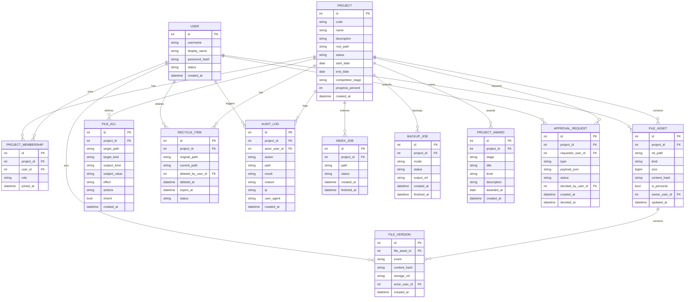

# ER 图（核心数据模型）

```mermaid
erDiagram
  USER {
    int id PK
    string username
    string display_name
    string password_hash
    string status
    datetime created_at
  }

  PROJECT {
    int id PK
    string code
    string name
    string description
    string root_path
    string status
    date start_date
    date end_date
    string competition_stage
    int progress_percent
    datetime created_at
  }

  PROJECT_MEMBERSHIP {
    int id PK
    int project_id FK
    int user_id FK
    string role
    datetime joined_at
  }

  FILE_ASSET {
    int id PK
    int project_id FK
    string rel_path
    string kind
    bigint size
    string content_hash
    bool is_personal
    int owner_user_id FK
    datetime updated_at
  }

  FILE_VERSION {
    int id PK
    int file_asset_id FK
    string event
    string content_hash
    string storage_ref
    int actor_user_id FK
    datetime created_at
  }

  FILE_ACL {
    int id PK
    int project_id FK
    string target_path
    string target_kind
    string subject_kind
    string subject_value
    string effect
    string actions
    bool inherit
    datetime created_at
  }

  RECYCLE_ITEM {
    int id PK
    int project_id FK
    string original_path
    string current_path
    int deleted_by_user_id FK
    datetime deleted_at
    datetime expire_at
    string status
  }

  AUDIT_LOG {
    int id PK
    int project_id FK
    int actor_user_id FK
    string action
    string path
    string result
    string reason
    string ip
    string user_agent
    datetime created_at
  }

  INDEX_JOB {
    int id PK
    int project_id FK
    string path
    string status
    datetime created_at
    datetime finished_at
  }

  BACKUP_JOB {
    int id PK
    int project_id FK
    string mode
    string status
    string output_ref
    datetime created_at
    datetime finished_at
  }

  PROJECT_AWARD {
    int id PK
    int project_id FK
    string stage
    string title
    string level
    string description
    date awarded_at
    datetime created_at
  }

  APPROVAL_REQUEST {
    int id PK
    int project_id FK
    int requester_user_id FK
    string type
    string payload_json
    string status
    int decided_by_user_id FK
    datetime created_at
    datetime decided_at
  }

  USER ||--o{ PROJECT_MEMBERSHIP : joins
  PROJECT ||--o{ PROJECT_MEMBERSHIP : has

  PROJECT ||--o{ FILE_ASSET : contains
  USER ||--o{ FILE_ASSET : owns

  FILE_ASSET ||--o{ FILE_VERSION : versions
  USER ||--o{ FILE_VERSION : acts

  PROJECT ||--o{ FILE_ACL : defines
  PROJECT ||--o{ RECYCLE_ITEM : has
  USER ||--o{ RECYCLE_ITEM : deletes

  PROJECT ||--o{ AUDIT_LOG : logs
  USER ||--o{ AUDIT_LOG : triggers

  PROJECT ||--o{ INDEX_JOB : indexes
  PROJECT ||--o{ BACKUP_JOB : backups
  PROJECT ||--o{ PROJECT_AWARD : awards
  PROJECT ||--o{ APPROVAL_REQUEST : requests
  USER ||--o{ APPROVAL_REQUEST : submits
```

说明：
- `FILE_ACL.target_path` 建议存相对路径（项目内沙箱），并统一规范化。
- `FILE_ASSET.is_personal + owner_user_id` 用于个人区“同项目内对他人不可见”。
