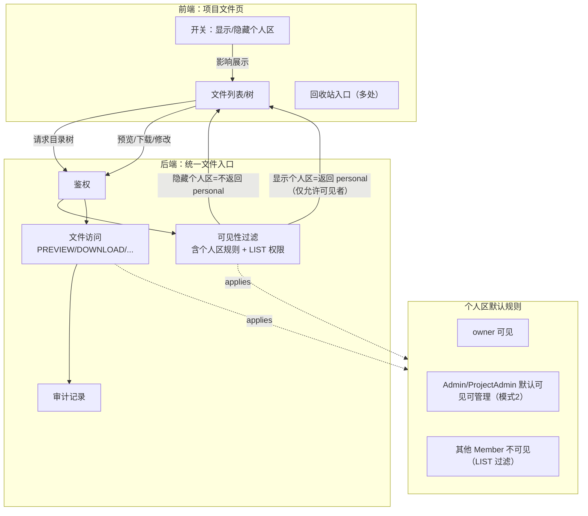

# 个人区访问策略图

```mermaid
graph TD
  subgraph UI[前端：项目文件页]
    TOGGLE[开关：显示/隐藏个人区]
    LIST[文件列表/树]
    BIN[回收站入口（多处）]
  end

  subgraph SVC[后端：统一文件入口]
    AUTH[鉴权]
    FILTER[可见性过滤<br/>含个人区规则 + LIST 权限]
    ACCESS[文件访问<br/>PREVIEW/DOWNLOAD/...]
    AUD[审计记录]
  end

  TOGGLE -->|影响展示| LIST
  LIST -->|请求目录树| AUTH
  AUTH --> FILTER

  FILTER -->|隐藏个人区=不返回 personal| LIST
  FILTER -->|显示个人区=返回 personal（仅允许可见者）| LIST

  LIST -->|预览/下载/修改| AUTH
  AUTH --> ACCESS --> AUD

  subgraph RULES[个人区默认规则]
    R1[owner 可见]
    R2[Admin/ProjectAdmin 默认可见可管理（模式2）]
    R3[其他 Member 不可见（LIST 过滤）]
  end

  FILTER -. applies .-> RULES
  ACCESS -. applies .-> RULES
```

说明：
- “隐藏个人区”只是 UI 过滤，不改变权限。
- “不可见”优先：对其他成员在目录列表阶段就不返回该资源。
