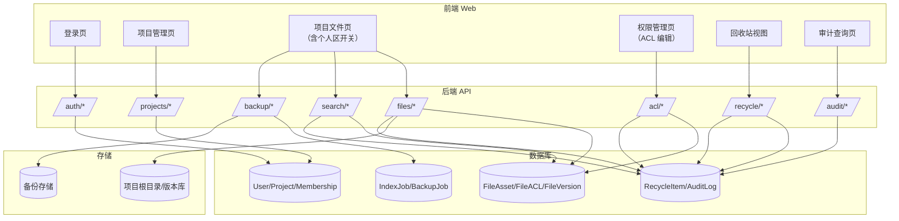
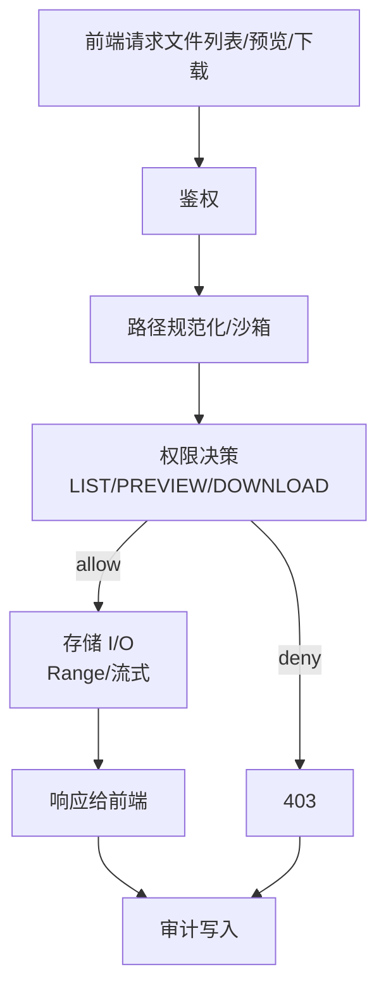
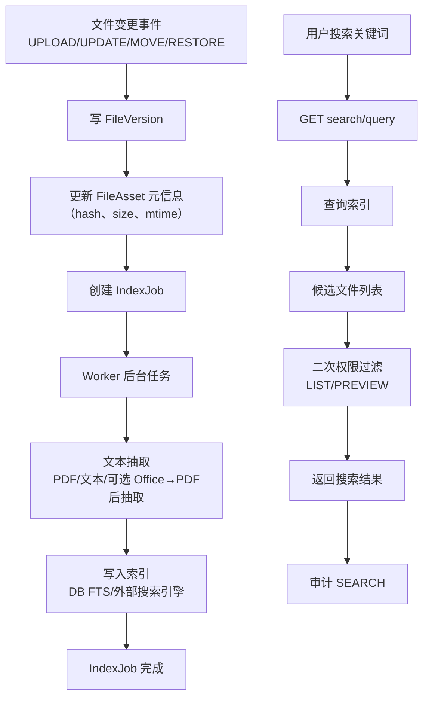
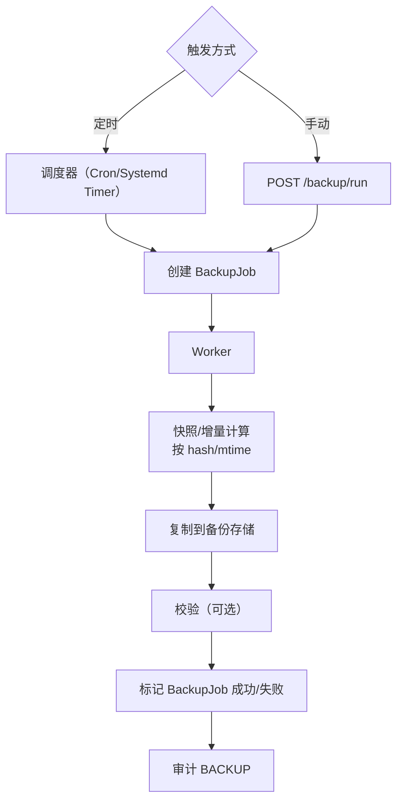
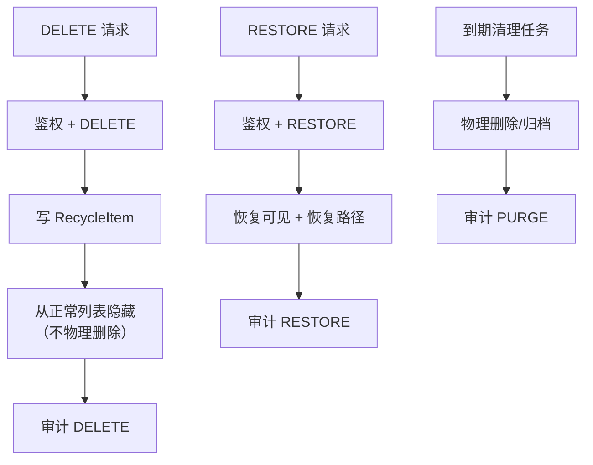

# 数据流向图（集中展示）

本文件描述前后端数据流向（DFD）、检索管线、备份管线等。

## 1) 前后端数据流向（DFD：核心页面）

```mermaid
flowchart TD
  subgraph FE[前端 Web]
    FE1[登录页]
    FE2[项目管理页]
    FE3[项目文件页<br/>（含个人区开关）]
    FE4[权限管理页<br/>（ACL 编辑）]
    FE5[回收站视图]
    FE6[审计查询页]
  end

  subgraph API[后端 API]
    A1[/auth/*/]
    A2[/projects/*/]
    A3[/files/*/]
    A4[/acl/*/]
    A5[/recycle/*/]
    A6[/audit/*/]
    A7[/search/*/]
    A8[/backup/*/]
  end

  subgraph DB[数据库]
    T1[(User/Project/Membership)]
    T2[(FileAsset/FileACL/FileVersion)]
    T3[(RecycleItem/AuditLog)]
    T4[(IndexJob/BackupJob)]
  end

  subgraph STORE[存储]
    S1[(项目根目录/版本库)]
    S2[(备份存储)]
  end

  FE1 --> A1 --> T1
  FE2 --> A2 --> T1
  FE3 --> A3 --> T2
  FE4 --> A4 --> T2
  FE5 --> A5 --> T3
  FE6 --> A6 --> T3
  FE3 --> A7 --> T2
  FE3 --> A8 --> T4

  A3 --> S1
  A8 --> S2

  A3 --> T3
  A4 --> T3
  A5 --> T3
  A7 --> T3
```

## 2) 文件读取数据流（列表→预览→下载）

```mermaid
flowchart TD
  REQ[前端请求文件列表/预览/下载] --> AUTH[鉴权]
  AUTH --> PATH[路径规范化/沙箱]
  PATH --> PERM[权限决策<br/>LIST/PREVIEW/DOWNLOAD]
  PERM -->|allow| IO[存储 I/O<br/>Range/流式]
  PERM -->|deny| DENY[403]
  IO --> RESP[响应给前端]
  RESP --> AUD[审计写入]
  DENY --> AUD
```

## 3) 检索管线（无 OCR）

```mermaid
flowchart TD
  CHG[文件变更事件<br/>UPLOAD/UPDATE/MOVE/RESTORE] --> V[写 FileVersion]
  V --> ASSET[更新 FileAsset 元信息（hash、size、mtime）]
  ASSET --> JOB[创建 IndexJob]

  JOB --> W[Worker 后台任务]
  W --> EXT[文本抽取<br/>PDF/文本/可选 Office→PDF后抽取]
  EXT --> IDX[写入索引<br/>DB FTS/外部搜索引擎]
  IDX --> DONE[IndexJob 完成]

  Q[用户搜索关键词] --> SEARCH_API[GET search/query]
  SEARCH_API --> IDXQ[查询索引]
  IDXQ --> CAND[候选文件列表]
  CAND --> FILTER[二次权限过滤<br/>LIST/PREVIEW]
  FILTER --> OUT[返回搜索结果]
  OUT --> AUD[审计 SEARCH]
```

## 4) 备份管线（定时 + 手动）

```mermaid
flowchart TD
  TRIG{触发方式} -->|定时| SCHED[调度器（Cron/Systemd Timer）]
  TRIG -->|手动| BACKUP_API[POST /backup/run]

  SCHED --> JOB[创建 BackupJob]
  BACKUP_API --> JOB

  JOB --> W[Worker]
  W --> SNAP[快照/增量计算<br/>按 hash/mtime]
  SNAP --> COPY[复制到备份存储]
  COPY --> VERIFY[校验（可选）]
  VERIFY --> DONE[标记 BackupJob 成功/失败]
  DONE --> AUD[审计 BACKUP]
```

## 5) 回收站数据流（软删除）

```mermaid
flowchart TD
  DEL[DELETE 请求] --> ACL[鉴权 + DELETE]
  ACL --> RI[写 RecycleItem]
  RI --> HIDE[从正常列表隐藏<br/>（不物理删除）]
  HIDE --> AUD[审计 DELETE]

  RES[RESTORE 请求] --> ACL2[鉴权 + RESTORE]
  ACL2 --> UNHIDE[恢复可见 + 恢复路径]
  UNHIDE --> AUD2[审计 RESTORE]

  PURGE[到期清理任务] --> PHY[物理删除/归档]
  PHY --> AUD3[审计 PURGE]
```
