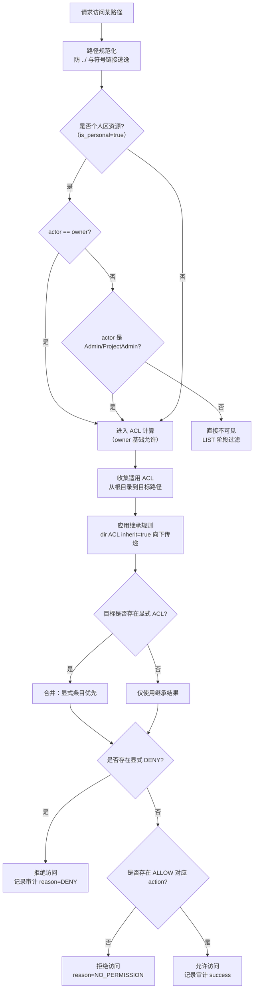

# 权限继承/覆盖图

```mermaid
flowchart TD
  A[请求访问某路径] --> B[路径规范化<br/>防 ../ 与符号链接逃逸]
  B --> C{是否个人区资源?<br/>（is_personal=true）}

  C -->|是| C1{actor == owner?}
  C1 -->|是| P1[进入 ACL 计算<br/>（owner 基础允许）]
  C1 -->|否| C2{actor 是 Admin/ProjectAdmin?}
  C2 -->|是| P1
  C2 -->|否| X1[直接不可见<br/>LIST 阶段过滤]

  C -->|否| P1

  P1 --> D[收集适用 ACL<br/>从根目录到目标路径]
  D --> E[应用继承规则<br/>dir ACL inherit=true 向下传递]
  E --> F{目标是否存在显式 ACL?}
  F -->|是| G[合并：显式条目优先]
  F -->|否| H[仅使用继承结果]

  G --> I{是否存在显式 DENY?}
  H --> I

  I -->|是| X2[拒绝访问<br/>记录审计 reason=DENY]
  I -->|否| J{是否存在 ALLOW 对应 action?}

  J -->|否| X3[拒绝访问<br/>reason=NO_PERMISSION]
  J -->|是| K[允许访问<br/>记录审计 success]
```

优先级建议：显式拒绝 > 显式允许 > 继承允许。
