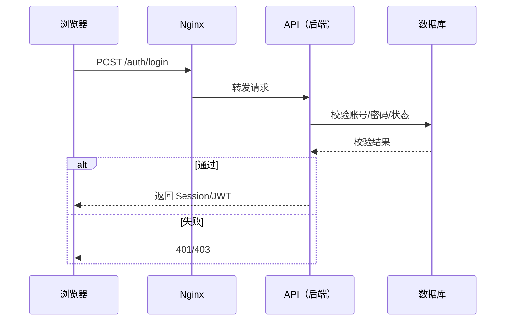
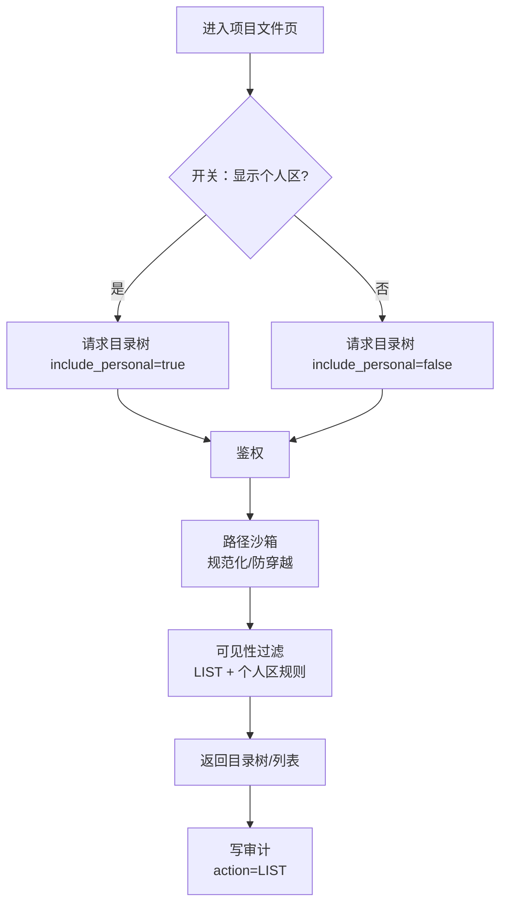
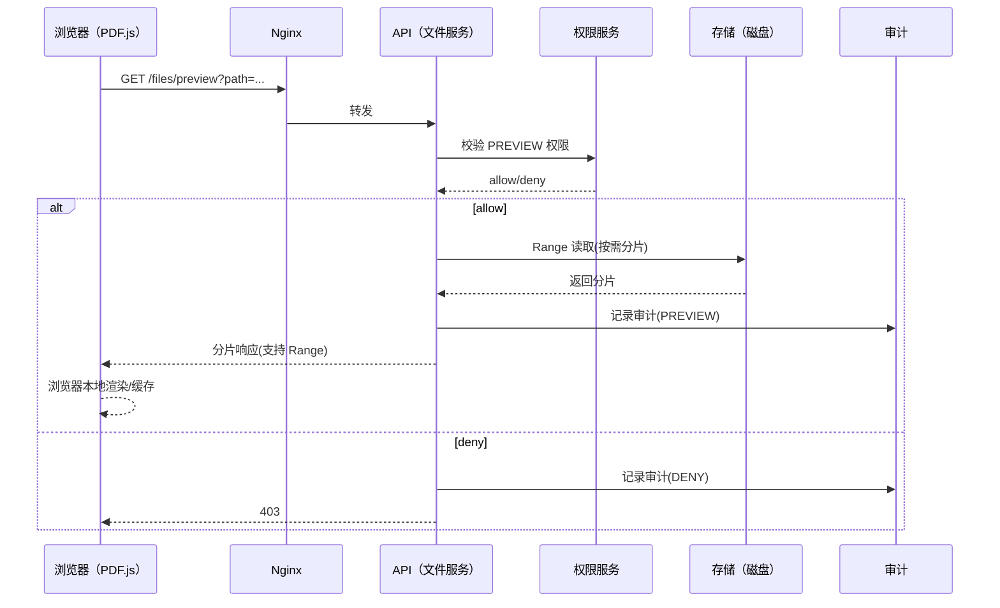
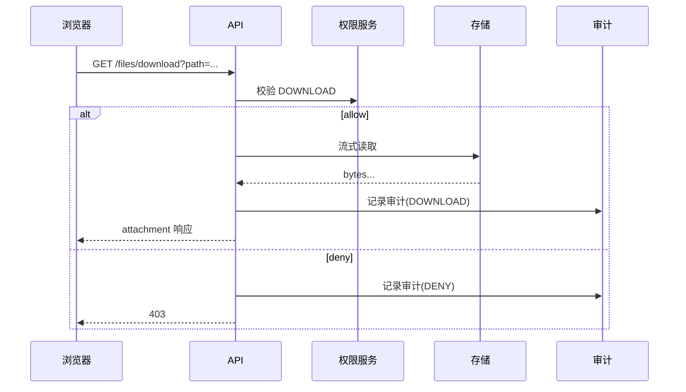
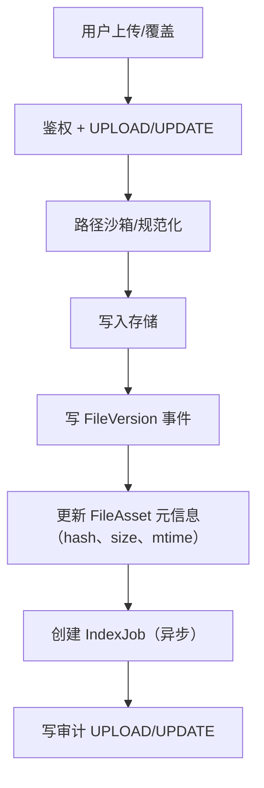
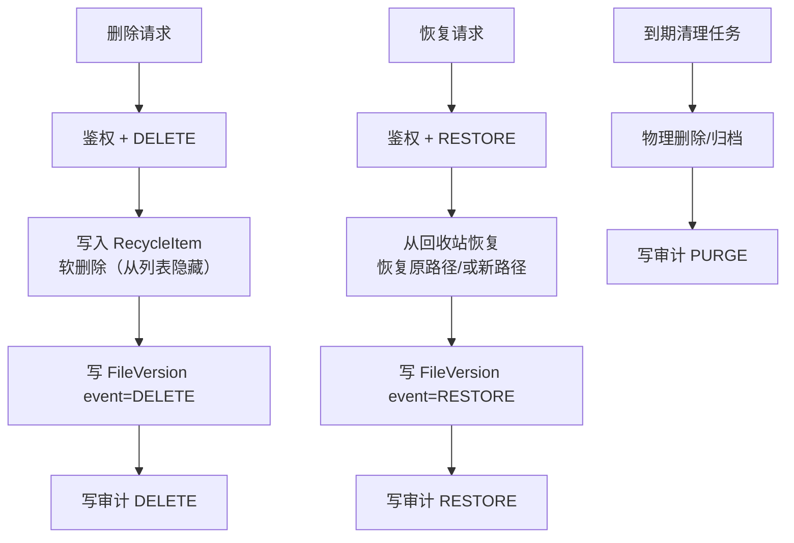
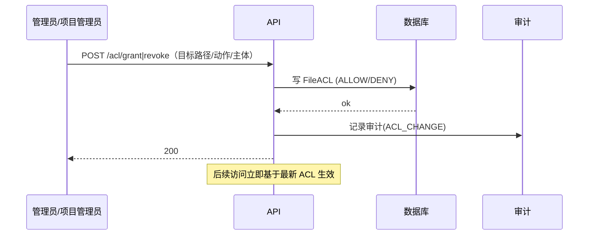
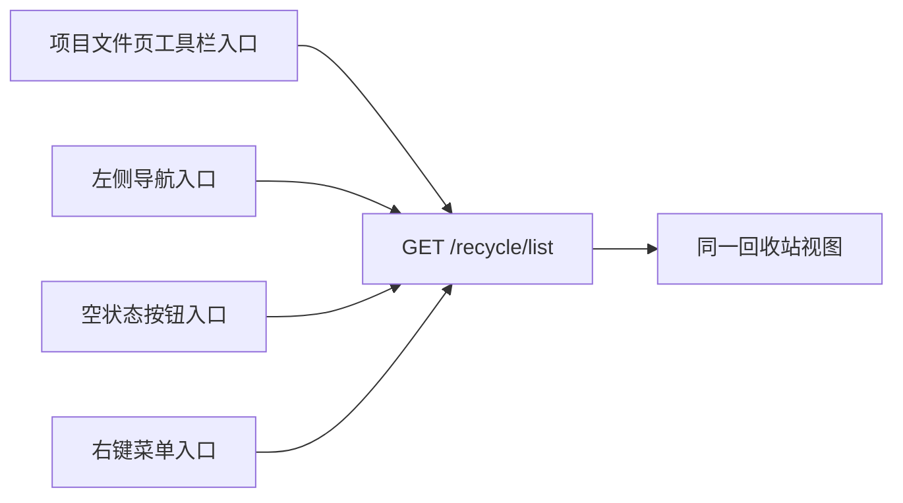

# 流程/时序图（集中展示）

本文件集中放置关键业务流程与时序图，供说明书引用。

## 1) 登录与鉴权时序

## 2) 文件树浏览流程（含个人区开关）

## 3) PDF 预览时序（Range + 低负载）

## 4) 下载时序（按权限控制）

## 5) 上传/覆盖更新流程（触发版本与索引）

## 6) 删除/回收站/恢复流程

## 7) 权限变更时序（ACL 管理）

## 8) 回收站入口（多处入口同一 API）

