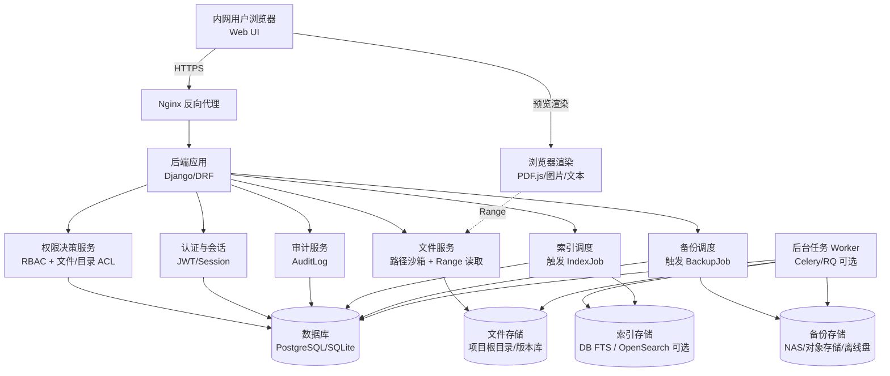

# 系统总体架构图

```mermaid
graph TD
  U[内网用户浏览器<br/>Web UI] -->|HTTPS| N[Nginx 反向代理]
  N --> A[后端应用<br/>Django/DRF]

  A --> AUTH[认证与会话<br/>JWT/Session]
  A --> PERM[权限决策服务<br/>RBAC + 文件/目录 ACL]
  A --> FS[文件服务<br/>路径沙箱 + Range 读取]
  A --> AUD[审计服务<br/>AuditLog]
  A --> IDX[索引调度<br/>触发 IndexJob]
  A --> BK[备份调度<br/>触发 BackupJob]

  PERM --> DB[(数据库<br/>PostgreSQL/SQLite)]
  AUTH --> DB
  AUD --> DB
  IDX --> DB
  BK --> DB

  FS --> STORE[(文件存储<br/>项目根目录/版本库)]
  BK --> BACKUP[(备份存储<br/>NAS/对象存储/离线盘)]

  W[后台任务 Worker<br/>Celery/RQ 可选] --> DB
  W --> STORE
  W --> BACKUP
  W --> SEARCH[(索引存储<br/>DB FTS / OpenSearch 可选)]
  IDX --> SEARCH

  U -->|预览渲染| R[浏览器渲染<br/>PDF.js/图片/文本]
  R -. Range .-> FS
```

说明：
- 在线请求尽量轻量：鉴权/审计/分片读取。
- 索引、文档转换（可选）、备份等重任务走后台。
- OCR 暂不纳入服务器端流程。
