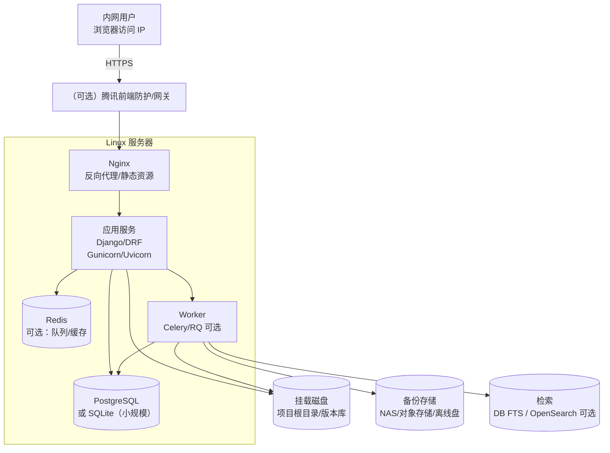

# 部署拓扑图（Linux）

```mermaid
graph TD
  LAN[内网用户<br/>浏览器访问 IP] -->|HTTPS| EDGE[（可选）腾讯前端防护/网关]
  EDGE --> N[Nginx<br/>反向代理/静态资源]

  N --> APP[应用服务<br/>Django/DRF<br/>Gunicorn/Uvicorn]

  APP --> DB[(PostgreSQL<br/>或 SQLite（小规模）)]
  APP --> STORE[(挂载磁盘<br/>项目根目录/版本库)]
  APP --> REDIS[(Redis<br/>可选：队列/缓存)]

  APP --> W[Worker<br/>Celery/RQ 可选]
  W --> DB
  W --> STORE
  W --> BACKUP[(备份存储<br/>NAS/对象存储/离线盘)]
  W --> SEARCH[(检索<br/>DB FTS / OpenSearch 可选)]

  subgraph Host[Linux 服务器]
    N
    APP
    W
    DB
    REDIS
  end
```

建议：
- 内网也建议 HTTPS（自签或内网 CA）。
- 文件存储使用独立挂载点，便于备份与权限隔离。
