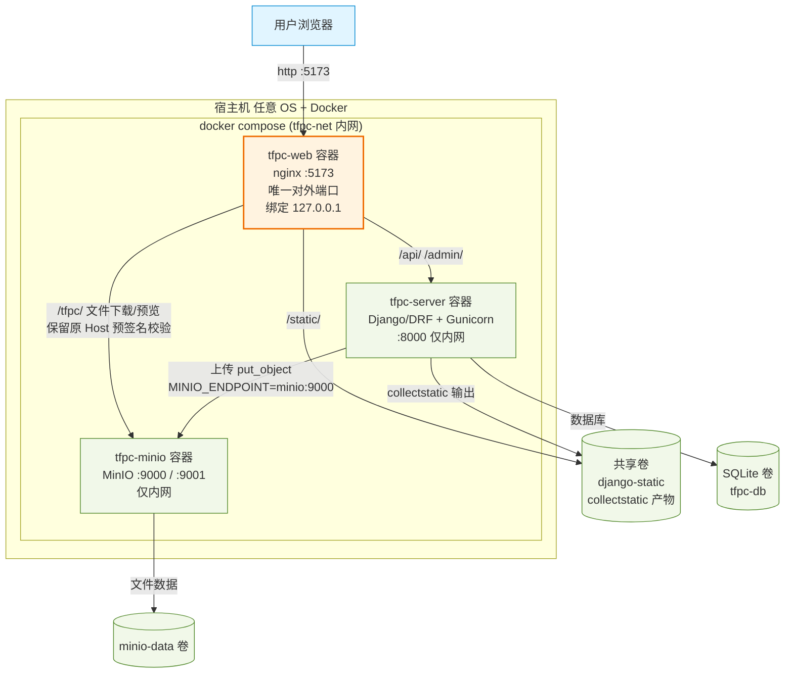

# 部署拓扑图（docker-compose，仅暴露 127.0.0.1:5173）

## 说明

- **唯一对外入口**：`tfpc-web`（nginx）监听 `127.0.0.1:5173`，宿主机仅此端口对外（且默认只本机可访问）。
- **容器名直连**：组件间通过 docker 自定义网络 `tfpc-net` 以容器名互访：
  - `web` → `server:8000`（API / Admin 反代）
  - `web` → `minio:9000`（文件下载/预览反代，保留浏览器原始 Host 以通过预签名校验）
  - `server` → `minio:9000`（服务端上传，使用 `MINIO_ENDPOINT=minio:9000`）
- **MinIO 双端点**：上传走 `MINIO_ENDPOINT`（容器内 `minio:9000`），生成给浏览器的预签名 URL 走 `MINIO_PUBLIC_ENDPOINT`（`127.0.0.1:5173`，经 nginx 反代）。
- **不对外暴露**：`server:8000`、`minio:9000/9001` 均不在宿主机端口表出现，仅 docker 内网可达。
- **静态资源**：`server` 容器 `collectstatic` 输出到共享卷 `django-static`，`web` 以只读方式挂载并提供 `/static/`。

## 对外访问决策

| 场景 | 端口映射 | 安全建议 |
|---|---|---|
| 仅本机浏览器 | `127.0.0.1:5173:5173`（默认） | 无需额外配置 |
| 局域网/公网访问 | `5173:5173`（监听所有网卡） | 前置 HTTPS 反代或 SSH 隧道，云安全组按需放行 |
